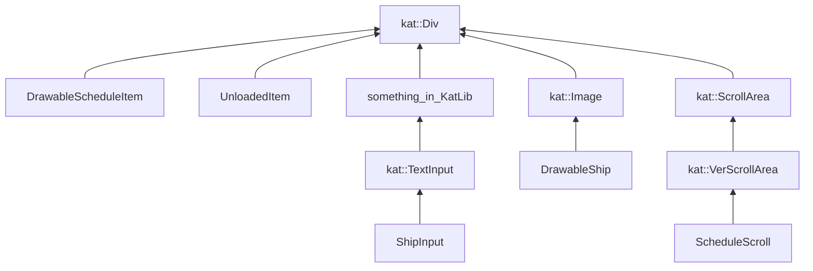
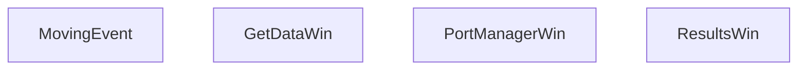
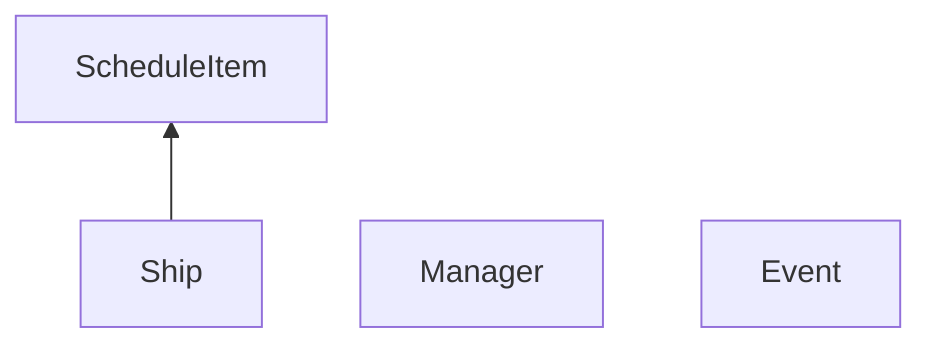
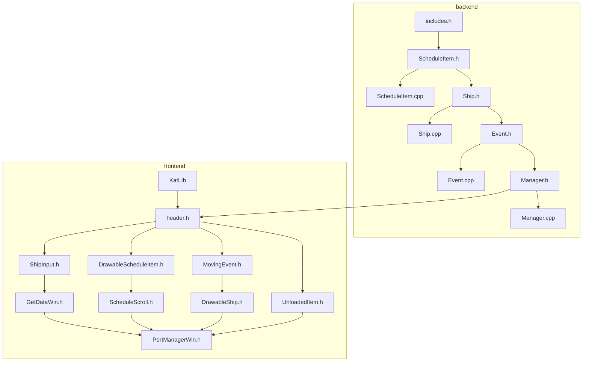

# Отчет о написании прака по моделированию работы морского порта

## Постановка задачи

Написание моделирования работы морского порта для проведения экспериментов по оптимизации времени прибытия кораблей
для уменьшения штрафного времени (нарисовать кораблики)

## Диаграмма классов

### Frontend

### Backend

## Текстовые спецификации основных классов системы
### Frontend

#### ShipInput
Обертка над четырьмя _kat::TextInput*_ для удобного размещения этих объектов в _kat::VerScrollArea_. Унаследован от _kat::TextInput_ для того, чтобы дергать ф-ии полей класса из переопределенных методов базового
Содержит поля ввода для:
+ Имя корабля
+ Тип груза корабля
+ Вес груза
+ Время планируемого прибытия
#### GetDataWin
Окно ввода дынных:
+ Разброс случайных величин
+ Количество кранов каждого типа
+ Количество и данные по кораблям
#### DrawableScheduleItem
Класс для отображаемого содержания расписания. Является оберткой над _kat::Button*_ (для центрирования текста), унаследован от _kat::Div_, для возможности отображаться на экране.
Содержит:
+ Флаг разгружен/не разгружен
+ Имя корабля
+ Тип груза корабля
+ Вес груза
+ Время планируемого прибытия
+ Предполагаемое время разгрузки
#### UnloadedItem
Класс для отображаемого содержания разгруженных кораблей. Является оберткой над _kat::Button*_ (для центрирования текста), унаследован от _kat::Div_, для возможности отображаться на экране.
Содержит:
+ Имя корабля
+ Фактическое время прибытия
+ Время ожидания в очереди
+ Время начала разгрузки
+ Фактическое время разгрузки
#### ScheduleScroll
Вынесен в отдельный класс чтобы добавить ф-ию _changeUnload(size_t)_ - по индексу меняет значение unload в i-ом _DrawableScheduleItem_ 
#### MovingEvent
Событие перемещения из точки A в точку B в момент времени с _start_time_ по _end_time_. Поле _is_y_first_, отвечает за то, по какой координате начнется перемещение
+ Ф-ия _getCoorInTime(int64_t)_ возвращает координаты корабля в момент time(параметр), вернет {-1e5, -1e5}, если во время time перемещение еще не началось, и {1e5, 1e5}, если уже закончилось
+ Ф-ия _getEndPos()_ возвращает координаты в момент времени _end_time_. 
#### DrawableShip
Отображаемый корабль. Наследован от _kat::Image_ для вывода на экран изображение. В конструкторе рандомно выбирает sprite корабля в зависимости от типа груза. Содержит _std::vector_ _MovingEvent_. С помощью ф-ии _updCoorInTime(int64_t time)_ рассчитывается позиция исходя из текущего времени (параметр) и данных из _MovingEvent_
#### PortManagerWin
Основной класс интерфейса. Содержит поля, необходимые для отображения и объект класса _Manager_, а также следующие ф-ии:
##### modeling()
Ф-ия отрисовки. Так же обрабатывает все события пользователя: нажатие кнопки мыши, перемещение курсора и т.д.
##### forwardEvents()
Последовательно обрабатывает события из объекта класса _Manager_, для которых время меньше или равно текущему времени в моделировании. 
##### convertEventToShip(const Event& event)
Переводит объект типа event в объекты типа _DrawableShip_ и _MovingEvent_. 
##### backwardEvent()
Откатывает события из объекта класса _Manager_, пока время события больше, чем текущее временя в моделировании.
##### rollbackEvent(const Event& event) 
Выполняет ту же функцию, что и _convertEventToShip_, но в обратную сторону по линии времени, те откатывает изменения, сделаные в convertEventToShip

#### ResultsWin
Отображает результаты моделирования. 

### Backend

#### ScheduleItem
Хранит информацию про запланированный приезд кораблей (расписание).
##### Поля:
* *type_* - тип груза
* *name_* - имя корабля
* *weight_* - вес груза
* *unload_time_* - время разгрузки
* *arrival_* - время прибытия в порт
##### Методы:
*Getters* для всех полей
#### Ship
Унаследован от ScheduleItem. Хранит всю информацию про корабль, необходимую для моделирования.
##### Поля:
* Поля класса ScheduleItem
* *fee_* - штраф корабля
* *start_of_unloading_* - время начала разгрузки корабля
* *waiting_time_* - время ожидания в очереди
##### Методы:
* Методы класса ScheduleItem
* *operator <* - сравнивает корабли по времени прибытия
* *Getters* и *setters* для полей *fee_, start_of_unloading_, waiting_time_*
* Setters для полей *fee_, start_of_unloading_, waiting_time_*
* *addToFee* - изменение штрафа
#### Event
Хранит информацию про события прибытия/отбытия/разгрузку кораблей.
##### Поля:
* *id_crane_* - индекс крана
* *time_* - время в которое происходит событие
* *type_* - тип события
* ship_ - указатель на корабль с которым происходит событие
##### Методы:
* *Getters* для всех полей класса
* *operator <*
#### Manager
Обобщающий класс backend. Принимает расписание и параметры моделирования. На их основе моделирует процесс, параллельно насчитывая статистику, выводимую в конце моделирования.
##### Поля:
* *ships_* - вектор всех кораблей, участвующих в моделировании (уже с опозданиями)
* *events_* - отсортированный вектор всех событий
* *schedule_* - расписание, данное из входных данных
* *count_container_cranes_, count_granular_cranes,  count_liquid_cranes_* - количество кранов
* *delay_min_, delay_max_,  late_arrival_min_, late_arrival_max_* - ограничения на случайные величины
* *fee_, total_delay_, max_delay_, total_waiting_time_,  delay_min_, delay_max_, max_time_* - статистические данные моделирования
* *ptr_* - индекс текущего события
##### Методы:
* *Getters* для статистических данных
* *Settres* для границ случайных величин
* *Setters* для количества кранов
* *setShips* меняет вектор кораблей, добавляет случайные величины к времени прибытия и времени разгрузки
* *modeling* - моделирует процесс работы порта
* *modelingForOneType* - приватный метод, моделирует процесс для одного типа кораблей

## Характеристика интерфейса

### Окно ввода данных
Содержит поля ввода для:
+ Ограничений на случайные величины
+ Количество кранов для грузов каждого вида
+ Количество кораблей (с возможностью увеличивать и уменьшать на единицу)

а так же для каждого отдельного корабля ввод:
+ Его имени, максимум 6 символов. По умолчанию будет рандомная комбинация из шести символов.
+ Типа его груза: 0/1/2 для контейнеров/жидкостей/сыпучих грузов соответственно. По умолчанию установлен тип 0.
+ Веса его груза. Максимум 3 символа. по умолчанию вес равен единице.
+ Время запланированного прибытия. Задается строкой вида день:час:минуты. по умолчанию 0.
### Окно моделирования
На экране отрисованы 3 полоски кранов: для контейнеров, жидких и сыпучих грузов, если смотреть сверху вниз. Эти краны обозначены желтым цветом. Зеленым цветом обозначены не используемые при данном моделировании краны для погрузки. При разном количестве кранов, свободно место в ряду заполняется дорогой с контейнерами.
  
В левом верхнем углу представлены две кнопки:
+ 's' - Schedule, кнопка открывает и закрывает панель с расписанием
+ 'u' - Unloaded, кнопка открывает и закрывает панель с разгруженными кораблями
+ 'results'  - кнопка открывает окно с результатами
  
На первой и второй дорогах представлены две фуры. Первая показывает текущее время, вторая же содержит элементы управления: перемотать на день раньше, поставить на паузу / запустить моделирование, перемотать на день дальше.
### Окно результатов
Выведены результаты по следующим величинам:
+ Количество кораблей
+ Средний размер очереди
+ Среднее время ожидания в очереди
+ Максимальная задержка разгрузки
+ Средняя задержка разгрузки
+ Суммарный штраф
соответственно

## Дерево зависимостей

Зависимости библиотеки KatLib описаны отдельно

## Используемые средства
Для разработки данной программы использовался язык C++ (23-ий стандарт), а так же графическая библиотека [KatLib](https://github.com/Katarni/KatLib). Для сборки был использован Cmake версии 3.23, а для написания отчета был использован MarkDown. Редакторы текста и среды разработки, использованные в работе:
+ Clion
+ Obsidian