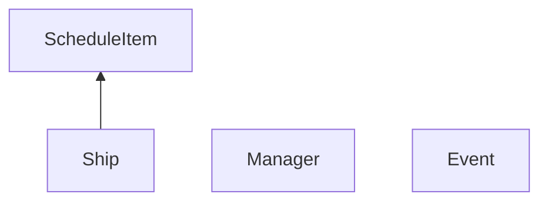

# Отчет о написании прака по моделированию работы морского порта

## Диаграмма классов
### Backend

## Текстовые спецификации основных классов системы
## Backend
### ScheduleItem
Хранит информацию про запланированный приезд кораблей (расписание).
#### Поля:
* *type_* - тип груза
* *name_* - имя корабля
* *weight_* - вес груза
* *unload_time_* - время разгрузки
* *arrival_* - время прибытия в порт
#### Методы:
*Getters* для всех полей
### Ship
Унаследован от ScheduleItem. Хранит всю информацию про корабль, необходимую для моделирования.
#### Поля:
* Поля класса ScheduleItem
* *fee_* - штраф корабля
* *start_of_unloading_* - время начала разгрузки корабля
* *waiting_time_* - время ожидания в очереди
#### Методы:
* Методы класса ScheduleItem
* *operator <* - сравнивает корабли по времени прибытия
* *Getters* и *setters* для полей *fee_, start_of_unloading_, waiting_time_*
* Setters для полей *fee_, start_of_unloading_, waiting_time_*
* *addToFee* - изменение штрафа
### Event
Хранит информацию про события прибытия/отбытия/разгрузку кораблей.
#### Поля:
* *id_crane_* - индекс крана 
* *time_* - время в которое происходит событие
* *type_* - тип события
* ship_ - указатель на корабль с которым происходит событие
#### Методы:
* *Getters* для всех полей класса
* *operator <*
### Manager
Обобщающий класс backend. Принимает расписание и параметры моделирования. На их основе моделирует процесс, параллельно насчитывая статистику, выводимую в конце моделирования.
#### Поля:
* *ships_* - вектор всех кораблей, участвующих в моделировании (уже с опозданиями)
* *events_* - отсортированный вектор всех событий
* *schedule_* - расписание, данное из входных данных
* *count_container_cranes_, count_granular_cranes,  count_liquid_cranes_* - количество кранов
* *delay_min_, delay_max_,  late_arrival_min_, late_arrival_max_* - ограничения на случайные величины
* *fee_, total_delay_, max_delay_, total_waiting_time_,  delay_min_, delay_max_, max_time_* - статистические данные моделирования
* *ptr_* - индекс текущего события
#### Методы:
* *Getters* для статистических данных
* *Settres* для границ случайных величин
* *Setters* для количества кранов
* *setShips* меняет вектор кораблей, добавляет случайные величины к времени прибытия и времени разгрузки
* *modeling* - моделирует процесс работы порта
* *modelingForOneType* - приватный метод, моделирует процесс для одного типа кораблей