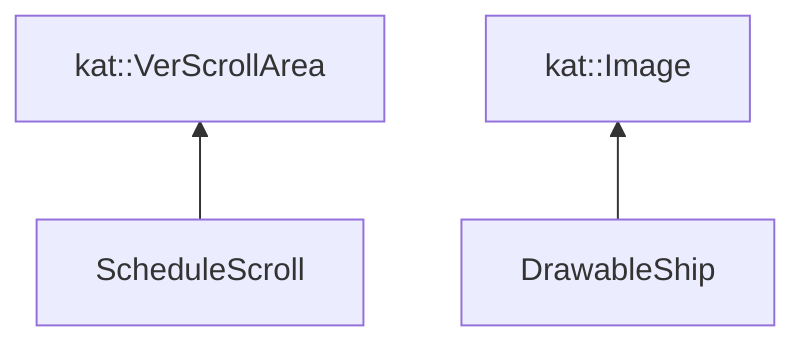
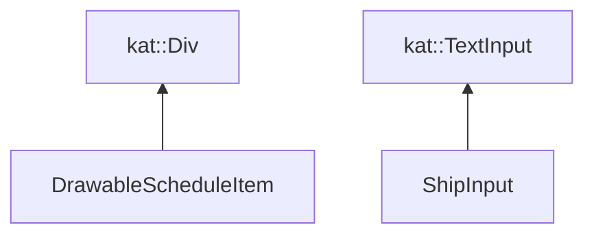
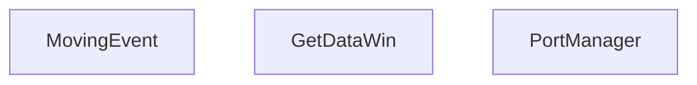

# Отчет о написании прака по моделированию работы морского порта

## Постановка задачи

Написание моделирования работы морского порта для проведения экспериментов по оптимизации времени прибытия кораблей для уменьшения штрафного времени (нарисовать кораблики)

## Диаграмма классов

### Frontend

