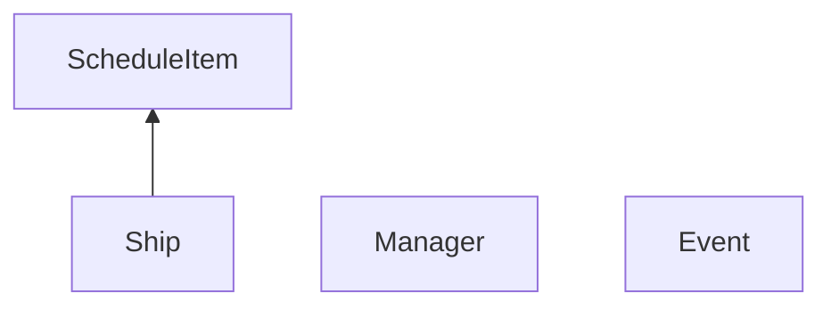

# Отчет о написании прака по моделированию работы морского порта

## Диаграмма классов
### Backend

## Текстовые спецификации основных классов системы
## Backend
### ScheduleItem
Хранит информацию про запланированный приезд кораблей (расписание).
### Ship
Унаследован от ScheduleItem. Хранит всю информацию про корабль, необходимую для моделирования.
### Event
Хранит информацию про события прибытия/отбытия/разгрузку кораблей.
### Manager
Обобщающий класс backend. Принимает расписание и параметры моделирования. На их основе моделирует процесс, параллельно насчитывая статистику, выводимую в конце моделирования.